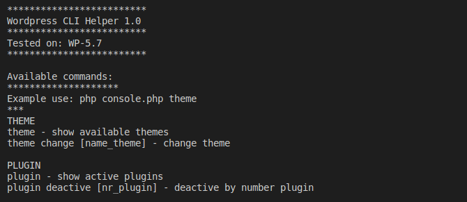

# wordpress-cli-ds

Simple wordpress console helper

This console no need any functions from Wordpress only includes wp-config.php file so it is very usefull when you got problems with display ``admin panel``

version 1.0


### Require
* PDO module
### How install
Simple just copy file ``console.php`` to your project, on the same level like wp-config.php.

### Usage
```bash
# Show available commands
php console.php

# Show themes
php console.php theme

# Change theme to twentythirteen
php console.php theme change twentythirteen

# Show active plugins
php console.php plugin

#result
Active plugins:
nr_plugin: 0  Name: avantgardia-modules/avantgardia-modules.php
nr_plugin: 1  Name: flowpaper-lite-pdf-flipbook/flowpaper.php

# Deactive plugin
php console.php plugin deactive 1
```

#### Tested on Wordpress ver:
* 5.7
